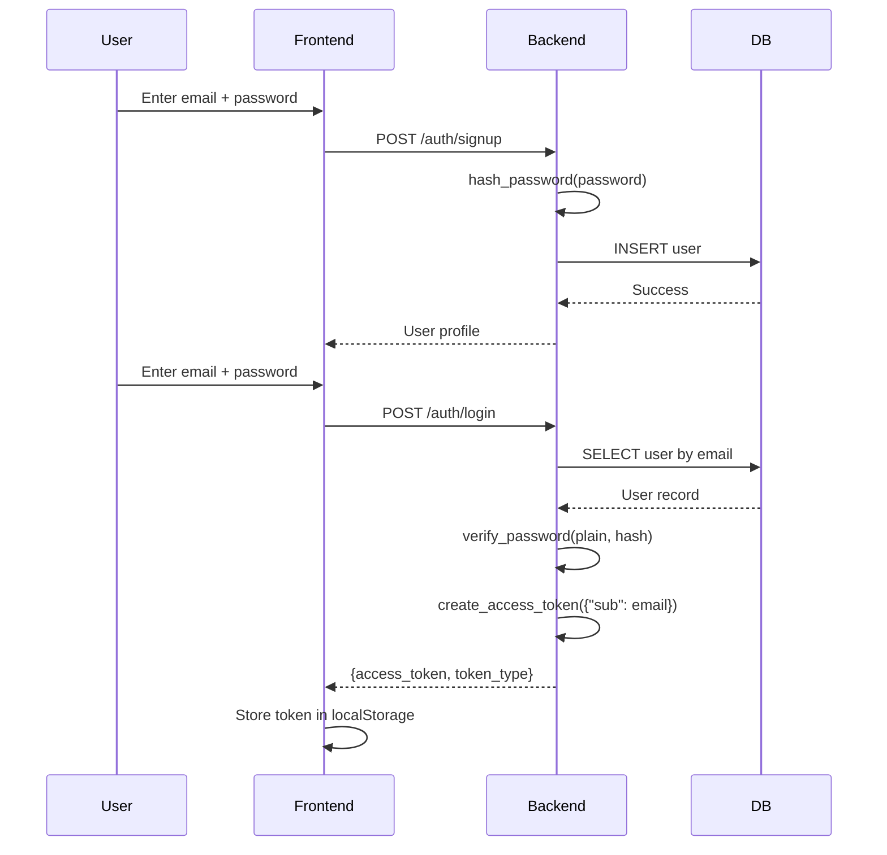

# Authentication & Security

This document covers the JWT authentication flow, security measures, and best practices for HireKarma.

---

## Authentication Flow

HireKarma uses **JWT Bearer tokens** with `python-jose` and `passlib` (bcrypt).

### Registration & Login



### Authenticated Requests

```mermaid
sequenceDiagram
    participant Frontend
    participant Backend
    participant JWT
    participant DB
    
    Frontend->>Backend: GET /auth/me
    Note Frontend: Authorization: Bearer <token>
    Backend->>JWT: decode_access_token(token)
    JWT-->>Backend: {"sub": "user@example.com", "exp": ...}
    Backend->>DB: SELECT * FROM users WHERE email = ?
    DB-->>Backend: User object
    Backend-->>Frontend: User profile JSON
```

---

## Token Structure

### Payload

| Claim | Value | Description |
| :--- | :--- | :--- |
| `sub` | User email | Subject — identifies the user |
| `exp` | Unix timestamp | Expiration time (60 minutes from creation) |

### Example Token

```
eyJhbGciOiJIUzI1NiIsInR5cCI6IkpXVCJ9.eyJzdWIiOiJqb2huQGV4YW1wbGUuY29tIiwiZXhwIjoxNzI... 
```

**Decoded (base64):**

```json
{
  "sub": "john@example.com",
  "exp": 1720000000
}
```

---

## Password Security

### Hashing

Passwords are hashed using **bcrypt** via `passlib`:

```python
# utils/security.py
hashed = hash_password("user_password")
# Returns: "$2b$12$LJ3m5z8K9..."
```

### Verification

```python
is_valid = verify_password("user_password", hashed)
# Returns: True or False
```

**Key properties:**
- Bcrypt is adaptive — the work factor can be increased as hardware improves.
- Each hash includes a unique salt, preventing rainbow table attacks.
- Passwords are never stored or logged in plaintext.

---

## Protected Routes

### Backend Protection

Protected routes use the `get_current_user` dependency:

```python
@router.get("/applications/")
def get_applications(
    current_user: User = Depends(get_current_user),
    db: Session = Depends(get_db)
):
    # current_user is guaranteed to be authenticated
    ...
```

If the token is missing or invalid, FastAPI returns `401 Unauthorized` before the route handler executes.

### Frontend Protection

The `ProtectedRoute` component wraps authenticated pages:

```jsx
<Route path="/dashboard" element={
  <ProtectedRoute>
    <Dashboard />
  </ProtectedRoute>
} />
```

- Shows a spinner while checking session validity.
- Redirects to `/login` if no valid token exists.
- Auto-logs out if `GET /auth/me` fails (stale token).

---

## Session Management

### Token Storage

- **Frontend**: Stored in `localStorage` under the key `"token"`.
- **Auto-injection**: Axios interceptor adds `Authorization: Bearer <token>` to all requests.
- **Auto-clear**: Token is removed from `localStorage` on logout or session validation failure.

### Session Hydration

On app mount:
1. Check `localStorage` for existing `token`.
2. If found, call `GET /auth/me` to validate.
3. On success, populate `user` state.
4. On failure, call `logout()` to clear stale state.

---

## Security Considerations

### Current Implementation

| Aspect | Status | Notes |
| :--- | :--- | :--- |
| Password hashing | ✅ Implemented | Bcrypt via passlib |
| JWT signing | ⚠️ Partial | Hardcoded `SECRET_KEY` — should be env var |
| Token expiry | ✅ Implemented | 60 minutes |
| HTTPS | ⚠️ Not enforced | Development only; use reverse proxy in production |
| Rate limiting | ❌ Not implemented | Consider adding for production |
| CORS | ⚠️ Permissive | Allows localhost origins; restrict in production |
| Input validation | ✅ Implemented | Pydantic schemas validate all inputs |
| SQL injection | ✅ Prevented | SQLAlchemy ORM with parameterized queries |

### Recommendations for Production

1. **Move `SECRET_KEY` to environment variable**:
   ```python
   import os
   SECRET_KEY = os.getenv("SECRET_KEY", "change-me-in-production")
   ```

2. **Enable HTTPS**: Use a reverse proxy (Nginx, Caddy) or platform-managed TLS (Render, Vercel).

3. **Add rate limiting**: Use `slowapi` or similar to prevent brute-force attacks on `/auth/login`.

4. **Restrict CORS origins**: Update `allow_origins` in `main.py` to your production domain only.

5. **Use short-lived access tokens + refresh tokens**: Currently, users must re-login after 60 minutes.

6. **Add account lockout**: After N failed login attempts, temporarily lock the account.

---

## API Key Security

### Gemini API Key

- Stored in `backend/.env` as `GEMINI_API_KEY`.
- Never committed to version control (`.gitignore` covers `.env`).
- Loaded via `python-dotenv` in `services/ai.py`.
- If missing, the system gracefully falls back to keyword-based responses.

### Best Practices

- Rotate keys periodically.
- Use separate keys for development and production.
- Monitor usage via Google AI Studio dashboard.

---

## Next Steps

- [API Reference](../api/endpoints.md) — Complete endpoint documentation
- [Configuration Guide](../getting-started/configuration.md) — Environment variables
- [Deployment Guides](../deployment/) — Production deployment
