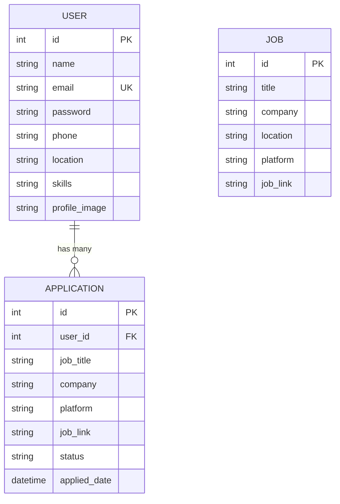

# Database Schema

This document describes the database layer, ORM models, and relationships used in HireKarma.

---

## Database Strategy

HireKarma uses a **resilient dual-database strategy**:

| Database | When Used | Purpose |
| :--- | :--- | :--- |
| **PostgreSQL** | When `DATABASE_URL` is configured and connection succeeds | Production deployments |
| **SQLite** | When `DATABASE_URL` is empty or PostgreSQL connection fails | Local development, offline use |

The fallback logic is implemented in `backend/app/database.py`.

---

## ORM Models

All models use SQLAlchemy 2.0 declarative syntax and are defined in `backend/app/models/`.

### User (`models/user.py`)

| Column | Type | Constraints | Description |
| :--- | :--- | :--- | :--- |
| `id` | `Integer` | PK, auto-increment | Unique user identifier |
| `name` | `String` | Not null | Full name |
| `email` | `String` | Unique, not null | Login identifier |
| `password` | `String` | Not null | Bcrypt-hashed password |
| `phone` | `String` | Nullable | Contact number |
| `location` | `String` | Nullable | User location |
| `skills` | `String` | Nullable | CSV string of tech skills |
| `profile_image` | `String` | Nullable | Filename of uploaded avatar |

**Notes**:
- Skills are stored as a **comma-separated string**, not a normalized table or array.
- A `@validates` decorator for email regex is present but commented out.
- No email uniqueness enforcement beyond the database unique constraint.

### Job (`models/job.py`)

| Column | Type | Constraints | Description |
| :--- | :--- | :--- | :--- |
| `id` | `Integer` | PK, auto-increment | Unique job identifier |
| `title` | `String` | Not null | Job title |
| `company` | `String` | Not null | Company name |
| `location` | `String` | Not null | Job location |
| `platform` | `String` | Not null | Source portal (LinkedIn, Naukri, etc.) |
| `job_link` | `String` | Not null | URL to the original posting |

**Notes**:
- Jobs are **global** — there is no `user_id` foreign key.
- Jobs are ephemeral: they are returned by the scraper and not persisted across sessions unless the user applies.
- The `jobs` table stores raw scraped data.

### Application (`models/application.py`)

| Column | Type | Constraints | Description |
| :--- | :--- | :--- | :--- |
| `id` | `Integer` | PK, auto-increment | Unique application identifier |
| `user_id` | `Integer` | FK to `users.id` | Owner of the application |
| `job_title` | `String` | Not null | Snapshot of job title at apply time |
| `company` | `String` | Not null | Snapshot of company at apply time |
| `platform` | `String` | Not null | Source portal |
| `job_link` | `String` | Not null | URL to the posting |
| `status` | `String` | Default `"Applied"` | Application status |
| `applied_date` | `DateTime` | UTC, auto-populated | When the application was logged |

**Notes**:
- **Denormalized design**: Job details are copied into the application record at apply-time.
- No foreign key to the `jobs` table — applications are immutable snapshots.
- This design ensures that even if a job is no longer in the scrape results, the application history remains intact.

---

## Entity Relationship Diagram



---

## Pydantic Schemas

Schemas are defined in `backend/app/schemas/` and use `from_attributes = True` for ORM serialization.

### User Schemas

| Schema | Fields | Purpose |
| :--- | :--- | :--- |
| `UserSignup` | `name`, `email`, `password` | Registration request |
| `ProfileUpdate` | `name`, `phone`, `location`, `skills` | Profile update request |
| `ProfileResponse` | `id`, `name`, `email`, `phone`, `location`, `skills`, `profile_image` | Profile response |

### Login Schema

| Schema | Fields | Purpose |
| :--- | :--- | :--- |
| `UserLogin` | `email`, `password` | Login request |

### Application Schemas

| Schema | Fields | Purpose |
| :--- | :--- | :--- |
| `ApplyJob` | `job_title`, `company`, `platform`, `job_link`, `status?` | Create application request |
| `ApplicationResponse` | All `Application` columns + `applied_date` | Application response |

---

## Database Migrations

HireKarma does **not** use Alembic or any migration tool. Tables are auto-created on startup:

```python
Base.metadata.create_all(bind=engine)
```

**Implications**:
- Schema changes require manual DB updates in production.
- Not suitable for teams with concurrent schema migrations.
- Consider adding Alembic for production deployments.

---

## Next Steps

- [Backend Architecture](../architecture/backend.md) — How models are used in routes
- [API Reference](../api/endpoints.md) — Endpoints that interact with the database
