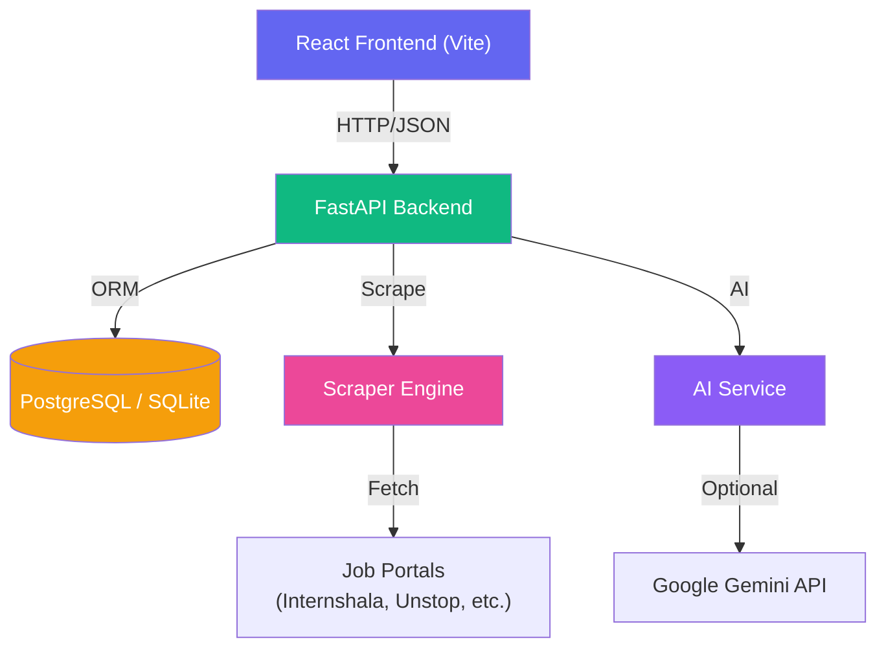
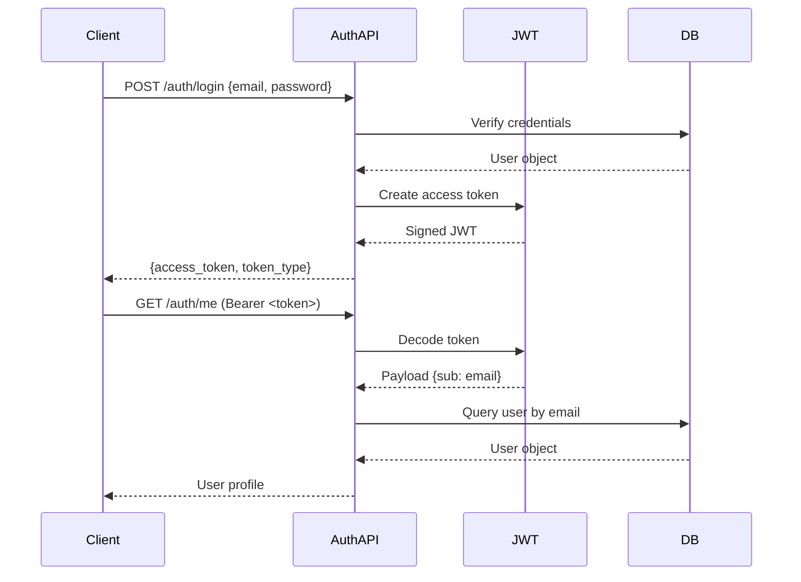
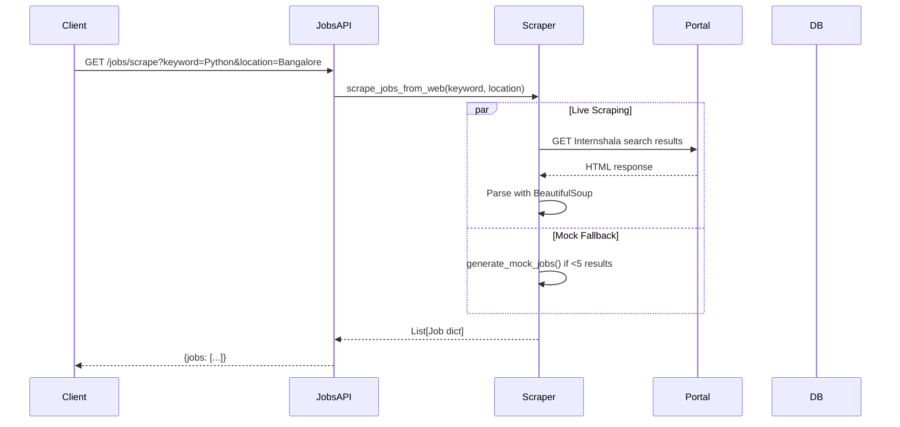
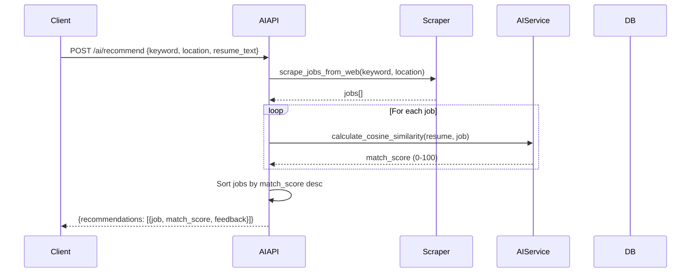

# Architecture Overview

This document provides a high-level view of the HireKarma system architecture, component relationships, and data flow.

---

## System Architecture



---

## Component Diagram

```
┌─────────────────────────────────────────────────────────────────────────┐
│                           React Frontend                                │
│  ┌─────────────┐  ┌─────────────┐  ┌─────────────┐  ┌───────────────┐  │
│  │  AuthContext │  │   Pages/    │  │ Components/ │  │ services/api  │  │
│  │  (JWT State)│  │ (Views)     │  │ (UI Reuse)  │  │  (Axios)      │  │
│  └─────────────┘  └─────────────┘  └─────────────┘  └───────────────┘  │
└─────────────────────────────────────────────────────────────────────────┘
                                    │
                              HTTP/HTTPS
                                    │
                                    ▼
┌─────────────────────────────────────────────────────────────────────────┐
│                          FastAPI Backend                                │
│  ┌───────────────────────────────────────────────────────────────────┐  │
│  │ main.py — App factory, CORS, static files, DB init               │  │
│  └───────────────────────────────────────────────────────────────────┘  │
│  ┌──────────┐ ┌──────────┐ ┌───────────┐ ┌──────────┐ ┌────────────┐ │
│  │ routes/  │ │ routes/  │ │  routes/  │ │ routes/  │ │  routes/   │ │
│  │ auth.py  │ │ jobs.py  │ │applications│ │profile.py│ │   ai.py    │ │
│  └──────────┘ └──────────┘ └───────────┘ └──────────┘ └────────────┘ │
│                                    │                                     │
│  ┌──────────────┐  ┌──────────────┐  ┌─────────────────────────────┐  │
│  │ scraper/     │  │ services/    │  │     models/                  │  │
│  │scraper_engine│  │    ai.py    │  │  user.py / job.py /         │  │
│  │              │  │              │  │  application.py              │  │
│  └──────────────┘  └──────────────┘  └─────────────────────────────┘  │
└─────────────────────────────────────────────────────────────────────────┘
                                    │
                              SQLAlchemy 2.0
                                    │
                                    ▼
┌─────────────────────────────────────────────────────────────────────────┐
│                            Database Layer                               │
│  ┌─────────────────────────┐    ┌──────────────────────────────────┐   │
│  │     PostgreSQL          │    │   SQLite (Fallback)              │   │
│  │   (Production)          │    │   jobscraper.db                  │   │
│  └─────────────────────────┘    └──────────────────────────────────┘   │
└─────────────────────────────────────────────────────────────────────────┘
```

---

## Core Flows

### 1. Authentication Flow



### 2. Scraping Flow



### 3. AI Recommendation Flow



---

## Design Patterns

| Pattern | Where Used | Description |
| :--- | :--- | :--- |
| **Dependency Injection** | `get_db`, `get_current_user` | Database sessions and authenticated users injected via `Depends()` |
| **Service Layer** | `services/ai.py`, `scraper/scraper_engine.py` | Business logic decoupled from route handlers |
| **Repository Pattern** | SQLAlchemy ORM + session | Data access abstracted through ORM models |
| **Graceful Degradation** | Scraper, AI, Database | Failed scrapers → mock data; failed DB → SQLite; no Gemini → keyword responses |
| **Router Modularization** | `app/routes/*.py` | Each domain split into its own `APIRouter` with prefix and tags |

---

## Next Steps

- [Backend Architecture](backend.md) — Deep dive into FastAPI structure
- [Frontend Architecture](frontend.md) — React app structure and routing
- [Database Schema](database.md) — ORM models and relationships
- [API Reference](../api/endpoints.md) — Complete endpoint documentation
