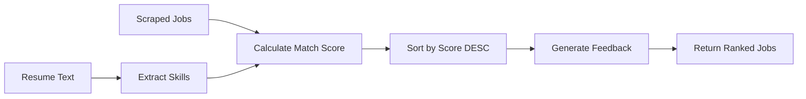

# AI Recommendations

This document details the AI-powered job recommendation engine, including cosine similarity scoring, job ranking, and the career advisor chat.

---

## Recommendation Engine

The AI recommendation system computes a **compatibility score** (0–100%) between a candidate's resume and each scraped job posting.

### Flow



### Components

1. **Text Extraction**: PDF resume → plain text via `PyPDF2`.
2. **Skill Parsing**: Regex-based extraction against ~20 known tech skills.
3. **Similarity Calculation**: TF-based cosine similarity between resume and job description.
4. **Scoring**: Convert similarity to percentage, add +25 buffer, cap at 100.
5. **Ranking**: Sort all jobs by `match_score` descending.

---

## Cosine Similarity

### Algorithm

```python
from collections import Counter
from math import sqrt

def calculate_cosine_similarity(text1: str, text2: str) -> float:
    words1 = text1.lower().split()
    words2 = text2.lower().split()
    counter1 = Counter(words1)
    counter2 = Counter(words2)
    
    intersection = set(counter1.keys()) & set(counter2.keys())
    numerator = sum(counter1[word] * counter2[word] for word in intersection)
    
    sum1 = sqrt(sum(count ** 2 for count in counter1.values()))
    sum2 = sqrt(sum(count ** 2 for count in counter2.values()))
    denominator = sum1 * sum2
    
    return numerator / denominator if denominator else 0.0
```

### Interpretation

| Score Range | Match Level |
| :--- | :--- |
| 80–100% | Excellent match |
| 60–79% | Good match |
| 40–59% | Partial match |
| 0–39% | Low match |

### Score Calculation

```python
def calculate_match_score(resume_text, job_title, job_description):
    combined_text = f"{job_title} {job_description}"
    similarity = calculate_cosine_similarity(resume_text, combined_text)
    match_score = min(100, int(similarity * 100 + 25))  # +25 buffer, cap at 100
    feedback = generate_feedback(match_score)
    return match_score, feedback
```

---

## Known Skills List

The resume parser matches against the following tech skills (case-insensitive):

```
python, react, java, javascript, typescript, docker, kubernetes, 
aws, azure, gcp, sql, mongodb, postgresql, mysql, redis, 
git, github, linux, node.js, express, django, flask, fastapi, 
spring, html, css, tailwind, bootstrap, figma, jest, pytest, 
ci/cd, terraform, ansible, graphql, rest, microservices
```

To add more skills, modify the `KNOWN_SKILLS` list in `backend/app/services/ai.py`.

---

## Career Advisor Chat

The `/ai/chat` endpoint provides SDE career guidance using a **3-tier fallback system**:

### Tier 1: Google Gemini API

- **Model**: `gemini-1.5-flash`
- **Trigger**: `GEMINI_API_KEY` is configured in `.env`
- **System Prompt**: "You are an expert SDE career advisor..."
- **Response**: Rich, contextual career advice

### Tier 2: Static Keyword Responses

- **Trigger**: No Gemini API key, but message matches a known keyword.
- **Topics covered**: DSA, DevOps, React, database design, Git, Docker, AWS, system design, behavioral interviews, resume tips, etc.

### Tier 3: Contextual Fallback

- **Trigger**: No API key and no keyword match.
- **Behavior**: Returns generic career-improvement advice incorporating the user's saved skills.

---

## API Endpoint

```
POST /ai/recommend
Authorization: Bearer <access_token>
```

### Request Body

```json
{
  "keyword": "Python Developer",
  "location": "Bangalore",
  "resume_text": "Experienced Python developer with React and AWS..."
}
```

### Response

```json
[
  {
    "title": "Senior Python Engineer",
    "company": "Google",
    "location": "Bangalore",
    "platform": "LinkedIn",
    "job_link": "https://linkedin.com/jobs/view/12345",
    "match_score": 92,
    "feedback": "Strong match! Your Python and AWS skills align well."
  }
]
```

---

## Limitations

| Limitation | Impact | Mitigation |
| :--- | :--- | :--- | :--- |
| Small skills list | ~20 skills only | Expand `KNOWN_SKILLS` list |
| TF-based similarity | No semantic understanding | Consider embeddings (e.g., Sentence-BERT) |
| +25 score buffer | May inflate scores for weak matches | Calibrate buffer based on real data |
| No job description | Only title + platform available | Scrape full job descriptions from portals |
| Mock data dependency | Recommendations may include fake jobs | Increase live scraper coverage |

---

## Next Steps

- [Resume Parser](../features/resume-parser.md) — How PDFs are parsed and skills extracted
- [Scraping Engine](../features/scraping.md) — Where job data comes from
- [API Reference](../api/endpoints.md) — `/ai/recommend` and `/ai/chat` endpoints
