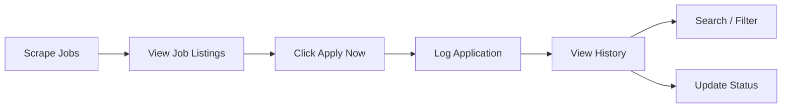

# Application Tracking

This document details the job application tracking system, including logging, history, status management, and search/filter capabilities.

---

## Overview

The application tracking system allows users to log job applications, track their status, and search through their application history.



---

## Data Model

Applications are stored in the `applications` table with **denormalized job snapshots**:

| Column | Type | Description |
| :--- | :--- | :--- |
| `id` | Integer | Primary key |
| `user_id` | Integer | Owner of the application |
| `job_title` | String | Snapshot of job title at apply time |
| `company` | String | Snapshot of company at apply time |
| `platform` | String | Source portal |
| `job_link` | String | URL to the original posting |
| `status` | String | Application status (default: `"Applied"`) |
| `applied_date` | DateTime | UTC timestamp when logged |

**Key design decision**: Applications are immutable snapshots. If the original job is modified or removed from the portal, the application record remains unchanged.

---

## Application Workflow

### 1. Scrape Jobs

User triggers a scrape with keyword and location:

```
GET /jobs/scrape?keyword=Python&location=Bangalore
```

### 2. View Results

Jobs are displayed in a table with:
- Title, Company, Location, Platform
- Match score (if AI recommendations)
- "Apply Now" button

### 3. Log Application

User clicks "Apply Now" → frontend sends:

```json
POST /applications/apply
{
  "job_title": "Python Developer",
  "company": "Google",
  "platform": "LinkedIn",
  "job_link": "https://linkedin.com/jobs/view/12345"
}
```

Backend creates an `Application` record with:
- `user_id` = current authenticated user
- `status` = `"Applied"` (default)
- `applied_date` = current UTC timestamp

### 4. Track History

User navigates to **Application History** page:
- Full list of applications, newest first.
- Search by job title or company.
- Filter by status (Applied, Interviewing, Rejected).
- Filter by platform.

---

## API Endpoints

### Log Application

```
POST /applications/apply
Authorization: Bearer <access_token>
```

**Request Body:**

```json
{
  "job_title": "Python Developer",
  "company": "Google",
  "platform": "LinkedIn",
  "job_link": "https://linkedin.com/jobs/view/12345"
}
```

**Response (201 Created):**

```json
{
  "id": 1,
  "user_id": 1,
  "job_title": "Python Developer",
  "company": "Google",
  "platform": "LinkedIn",
  "job_link": "https://linkedin.com/jobs/view/12345",
  "status": "Applied",
  "applied_date": "2026-07-13T20:30:00"
}
```

### List Applications

```
GET /applications/?search=Google&status=Applied&limit=10&offset=0
Authorization: Bearer <access_token>
```

**Query Parameters:**

| Parameter | Type | Description |
| :--- | :--- | :--- |
| `search` | string | ILIKE search on `job_title` or `company` |
| `status` | string | Exact match on `status` |
| `platform` | string | Exact match on `platform` |
| `limit` | integer | Results per page (default: 10) |
| `offset` | integer | Pagination offset |

**Response (200 OK):**

```json
[
  {
    "id": 1,
    "user_id": 1,
    "job_title": "Python Developer",
    "company": "Google",
    "platform": "LinkedIn",
    "job_link": "https://linkedin.com/jobs/view/12345",
    "status": "Applied",
    "applied_date": "2026-07-13T20:30:00"
  }
]
```

---

## Status Values

The `status` field is a free-text string, but the frontend recognizes these common values:

| Status | Description |
| :--- | :--- |
| `Applied` | Application submitted, awaiting response |
| `Interviewing` | Interview process in progress |
| `Rejected` | Application was rejected |
| `Offered` | Job offer received |
| `Accepted` | Offer accepted |
| `Withdrawn` | Application withdrawn by candidate |

---

## Frontend Features

### Application History Page

- **Search bar**: Real-time search by job title or company.
- **Status filters**: Quick-filter buttons for common statuses.
- **Results table**: Displays all application fields with formatted dates.
- **Empty state**: Friendly message when no applications exist.

### Dashboard Integration

The Dashboard shows:
- Total applications count.
- Recent applications (last 5).
- Quick stats by status (cards).

---

## Limitations

| Limitation | Impact | Future Improvement |
| :--- | :--- | :--- |
| No status update endpoint | Users cannot change status via API | Add `PATCH /applications/{id}` |
| No status change history | Cannot track when status changed | Add `ApplicationStatusHistory` table |
| No notes/reminders | Cannot add personal notes | Add `notes` column or separate table |
| No reminders/notifications | No follow-up reminders | Add email/push notification service |
| Manual apply only | No auto-apply | Consider OAuth integrations with job portals |

---

## Next Steps

- [API Reference](../api/endpoints.md) — Complete application endpoint docs
- [Architecture Overview](../architecture/overview.md) — System design
- [Getting Started](../getting-started/installation.md) — Set up locally
