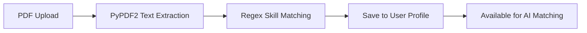

# Resume Parser

This document details the PDF resume parsing pipeline, including text extraction, skill extraction, and profile integration.

---

## Overview

The resume parser extracts text from uploaded PDF resumes, identifies tech skills, and saves them to the user's profile for AI-powered job matching.



---

## Upload Flow

### Frontend

1. User navigates to **Profile** page.
2. Clicks "Upload Resume" and selects a PDF file.
3. Frontend sends `POST /ai/parse-resume` with `multipart/form-data`.

### Backend

1. Receive uploaded file via FastAPI's `UploadFile`.
2. Read file bytes.
3. Extract text from all pages using `PyPDF2`.
4. Apply regex matching against known skills list.
5. Save extracted skills (title-cased, comma-separated) to `users.skills`.
6. Return extracted skills to frontend.

---

## Text Extraction

### Library

`PyPDF2` (version 3.0.1)

### Process

```python
def extract_text_from_pdf(pdf_bytes: bytes) -> str:
    pdf_file = BytesIO(pdf_bytes)
    reader = PdfReader(pdf_file)
    text = ""
    for page in reader.pages:
        text += page.extract_text() + "\n"
    return text
```

### Limitations

- Works best with text-based PDFs (not scanned images).
- Scanned PDFs require OCR (e.g., `pytesseract`) — not currently supported.
- Complex layouts (multi-column, tables) may produce garbled text.

---

## Skill Extraction

### Known Skills List

The parser matches against ~20 predefined tech skills:

```
python, react, java, javascript, typescript, docker, kubernetes,
aws, azure, gcp, sql, mongodb, postgresql, mysql, redis,
git, github, linux, node.js, express, django, flask, fastapi,
spring, html, css, tailwind, bootstrap, figma, jest, pytest,
ci/cd, terraform, ansible, graphql, rest, microservices
```

### Matching Logic

```python
def parse_resume_skills(text: str) -> List[str]:
    text_lower = text.lower()
    found_skills = []
    for skill in KNOWN_SKILLS:
        if re.search(r'\b' + re.escape(skill) + r'\b', text_lower):
            found_skills.append(skill.title())
    return found_skills
```

**Key features:**
- Case-insensitive matching.
- Word boundary (`\b`) regex prevents partial matches (e.g., "Java" won't match "JavaScript").
- Skills are returned in title case for consistency.

---

## API Endpoint

```
POST /ai/parse-resume
Authorization: Bearer <access_token>
Content-Type: multipart/form-data
```

### Request

| Field | Type | Description |
| :--- | :--- | :--- |
| `file` | `UploadFile` | PDF resume file |

### Response

```json
{
  "skills_extracted": ["Python", "React", "Docker", "AWS"],
  "message": "Successfully parsed 4 skills from resume"
}
```

### Errors

| Status | Condition |
| :--- | :--- |
| `400 Bad Request` | File is not a PDF or is empty |
| `401 Unauthorized` | Missing or invalid token |

---

## Profile Integration

Extracted skills are saved to the `users.skills` column as a comma-separated string:

```python
user.skills = ", ".join(extracted_skills)
db.commit()
```

These skills are later used in:
1. **AI Recommendations** — Included in resume text for cosine similarity scoring.
2. **Career Advisor Chat** — Included in system prompt for contextual advice.

---

## Usage Example

### Frontend

```jsx
const handleResumeUpload = async (file) => {
  const formData = new FormData();
  formData.append("file", file);
  
  const res = await API.post("/ai/parse-resume", formData, {
    headers: { "Content-Type": "multipart/form-data" },
  });
  
  console.log(res.data.skills_extracted);
  // ["Python", "React", "Docker", "AWS"]
};
```

---

## Improving the Parser

### Adding More Skills

Edit `KNOWN_SKILLS` in `backend/app/services/ai.py`:

```python
KNOWN_SKILLS = [
    "python", "react", "java", "javascript", "typescript",
    "docker", "kubernetes", "aws", "azure", "gcp",
    "sql", "mongodb", "postgresql", "mysql", "redis",
    "git", "github", "linux", "node.js", "express",
    # Add your skills here
]
```

### Supporting OCR for Scanned PDFs

Install `pytesseract` and `pdf2image`:

```python
from pdf2image import convert_from_bytes
import pytesseract

def extract_text_from_scanned_pdf(pdf_bytes):
    images = convert_from_bytes(pdf_bytes)
    text = ""
    for image in images:
        text += pytesseract.image_to_string(image) + "\n"
    return text
```

---

## Next Steps

- [AI Recommendations](../features/ai-recommendations.md) — How skills are used for job matching
- [AI Chat](../features/ai-recommendations.md) — Career advisor with skill context
- [API Reference](../api/endpoints.md) — `/ai/parse-resume` endpoint details
