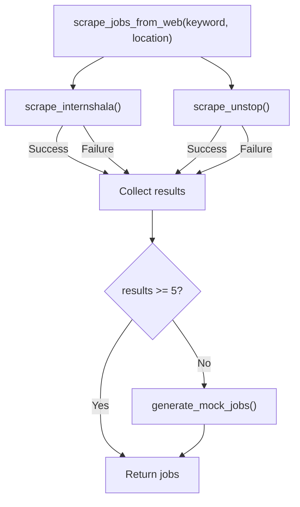

# Scraping Engine

This document details the multi-portal job scraping engine, including data sources, parsing logic, and fallback mechanisms.

---

## Overview

The scraping engine aggregates job listings from multiple Indian job portals. It is designed to gracefully handle anti-bot protections and inconsistent page structures by implementing a **fallback-first architecture**.



---

## Data Sources

### Internshala

| Attribute | Details |
| :--- | :--- |
| **URL Pattern** | `https://internshala.com/internships/keyword-in-location/` |
| **Status** | ✅ Active |
| **Method** | HTTP GET + BeautifulSoup parsing |
| **Rate Limiting** | 5-second timeout per request |
| **Results per call** | Up to 3 jobs |

#### Scraping Logic

1. Construct search URL with keyword and location.
2. Send HTTP GET with a modern Chrome User-Agent.
3. Parse HTML with BeautifulSoup.
4. Target `div.container-fluid.individual_internship` cards.
5. Extract:
   - **Title**: `h3.heading_4_5` text
   - **Company**: `a.link_display_like_and_regular` text
   - **Location**: `a.location_link` text
   - **Link**: `href` attribute of the card

#### User-Agent

```
Mozilla/5.0 (Windows NT 10.0; Win64; x64) AppleWebKit/537.36 (KHTML, like Gecko) Chrome/120.0.0.0 Safari/537.36
```

### Unstop

| Attribute | Details |
| :--- | :--- |
| **URL Pattern** | N/A (stub) |
| **Status** | ⚠️ Stub — returns empty results |
| **Reason** | Unstop uses client-side rendering (React/SPA) |
| **Future** | Planned integration with headless browser (Playwright/Selenium) |

---

## Mock Data Generator

When live scraping returns fewer than 5 jobs, `generate_mock_jobs()` creates realistic fallback data.

### Mock Job Structure

```python
{
    "title": f"{keyword} at {company}",
    "company": company,
    "location": location,
    "platform": random.choice(["LinkedIn", "Naukri", "Internshala", "Unstop"]),
    "job_link": f"https://{platform.lower()}.com/jobs/view/{random.randint(10000, 99999)}"
}
```

### Company Pool

Fixed list of well-known Indian/global tech companies:
- Google, Amazon, Microsoft, Razorpay, Flipkart, Swiggy, Zomato, Cred, PhonePe, Ola, Uber, Spotify, Netflix, Adobe, Salesforce, Informatica, PayPal, Walmart Labs, Dream11, InMobi

---

## API Endpoint

```
GET /jobs/scrape?keyword={keyword}&location={location}
Authorization: Bearer <access_token>
```

### Response Format

```json
[
  {
    "title": "Python Developer",
    "company": "Google",
    "location": "Bangalore",
    "platform": "LinkedIn",
    "job_link": "https://linkedin.com/jobs/view/12345"
  }
]
```

---

## Error Handling

The scraping engine wraps each source in a `try/except` block:

```python
try:
    internshala_jobs = scrape_internshala(keyword, location)
except Exception:
    internshala_jobs = []

try:
    unstop_jobs = scrape_unstop(keyword, location)
except Exception:
    unstop_jobs = []
```

**Key principles:**
- Individual source failures do not break the entire request.
- Errors are silently logged; the client only sees the aggregated results.
- Mock data ensures a minimum viable response for demo/testing.

---

## Extending the Scraper

To add a new job portal:

1. Create a new function in `scraper_engine.py`:

   ```python
   def scrape_newportal(keyword: str, location: str) -> List[dict]:
       # 1. Construct search URL
       # 2. Fetch HTML
       # 3. Parse with BeautifulSoup
       # 4. Return list of job dicts
       pass
   ```

2. Add it to the orchestrator:

   ```python
   def scrape_jobs_from_web(keyword, location):
       try:
           results += scrape_newportal(keyword, location)
       except Exception:
           pass
   ```

3. Update the mock data generator if needed.

---

## Rate Limiting & Ethics

- A 5-second timeout is set on all requests.
- No concurrent requests are made to the same domain.
- Consider adding delays between requests for production use.
- Review each portal's `robots.txt` and Terms of Service before scraping at scale.

---

## Next Steps

- [AI Recommendations](../features/ai-recommendations.md) — How scraped jobs are ranked
- [API Reference](../api/endpoints.md) — `/jobs/scrape` endpoint details
- [Backend Architecture](../architecture/backend.md) — Scraper engine implementation
